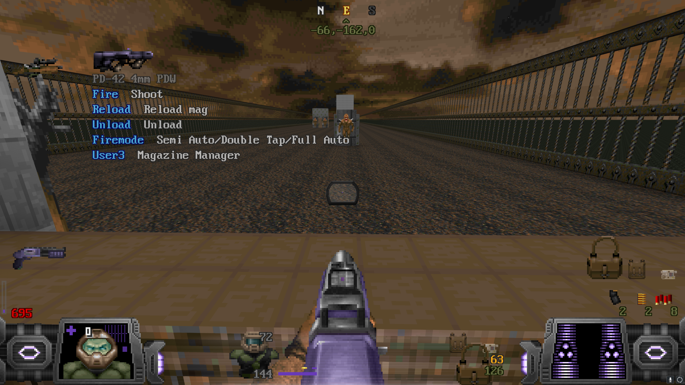
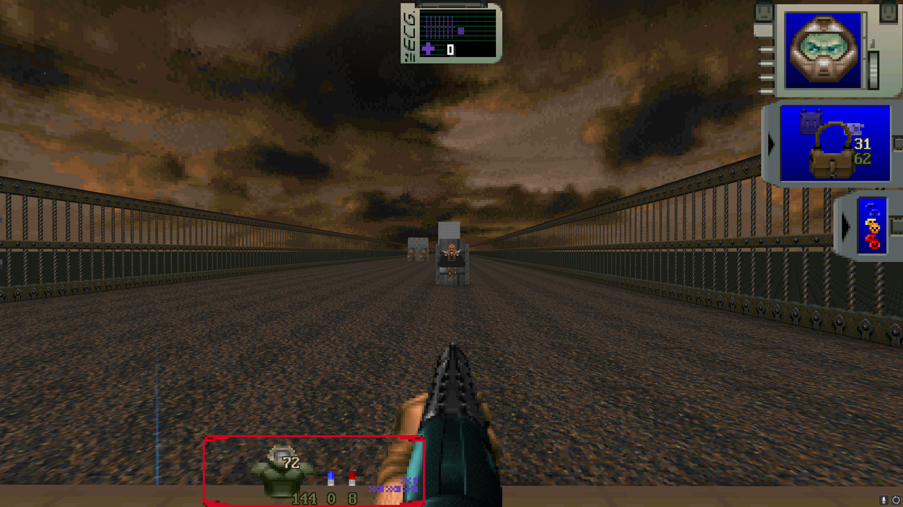
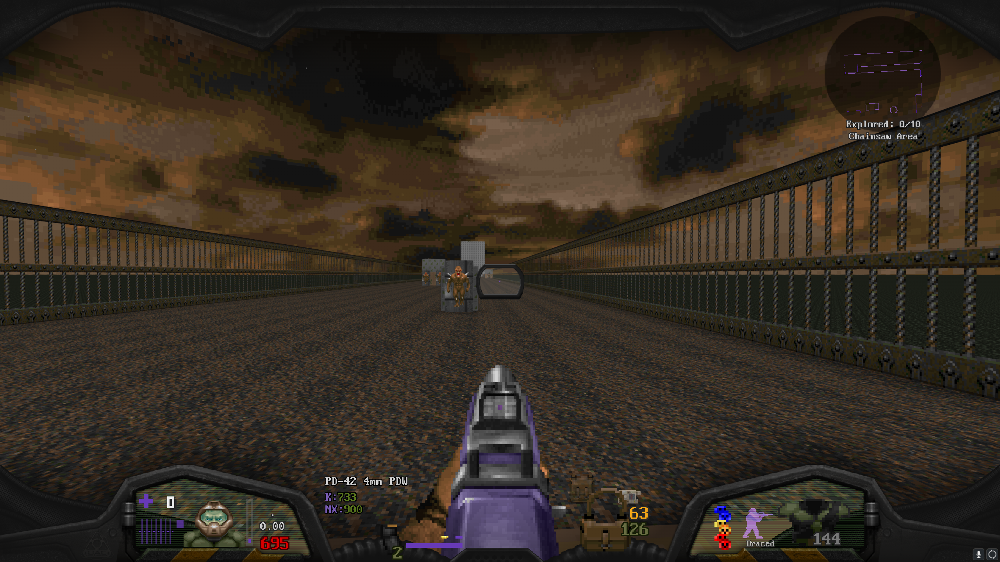
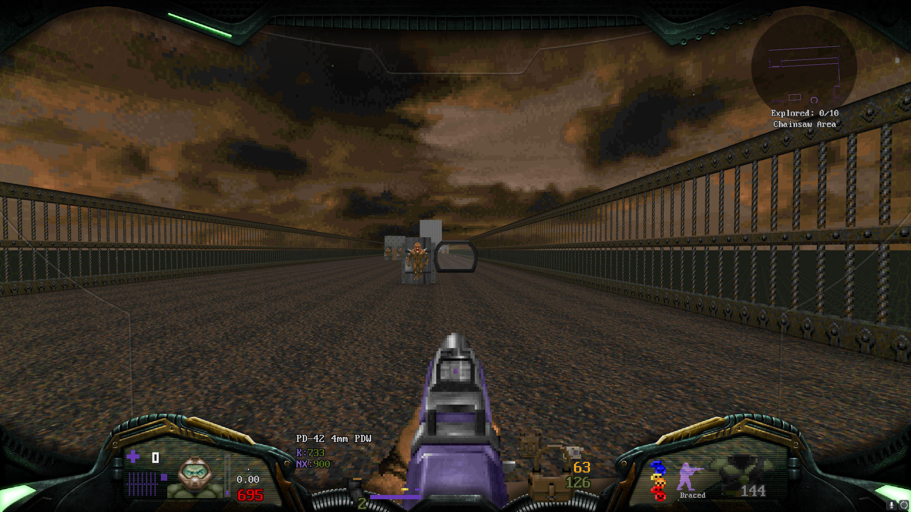

# Hideous Helmet Extended

_Requires [HUDCore](https://github.com/dastrukar/hdest-hudcore) by Dastrukar_  
_Supports [Hideous Helmet](https://github.com/dastrukar/hideous-helmet) by Dastrukar_

Ever wanted your HUD to _feel_ like it was inside your HHelmet?  Would you like more control over your HUD Elements?  Well boy howdy do I have the add-on for you!  Loading this after HUDCore/HHelmet will add a new Helmet Overlay HUD Element, as well as update the existing HUD elements, to allow you to customize your HUD much more than before, not to mention make the HUD feel more diegetic and immserive!

### Examples
_NOTE: The screenshots shown below contain extra addons to achieve the desired effect, including [Hudeous kMinimap](https://dastrukar.gitlab.io/hddons-list/#misc:hudeouskminimap-fda), [Hudeous War Trophies](https://cdn.discordapp.com/attachments/462331550768431104/1043709953828982784/wartrophies-v1.10.2_helmet_fork_1.1.zip), and [my personal reskin addon](https://github.com/UndeadZeratul/uzHDAddon)._

  
  
  
  
  
  

### Limitations
While I've done what I can to allow HUD Elements to be customizable, some elements have their limitations, such as not being able to be scaled or repositioned at all.  This is due to how the HUD draws its elements and where that control is given when doing so.  Drawing armour durability bars does not support scaling and must be drawn at 100% its original size.  Weapon Statuses are entirely under the control of the weapon that draws them, so this HUD cannot move them around or scale them.

## Credits

Radsuit Overlay:
- 3D Realms

Respirator Overlay:
- 3D Realms

Hideous Helmet HUD Element Scripts:
- Dastrukar

Alpha Doom HUD:
- TommyGalano5
- ID Software
- Sgt. Kiwi
- Arcterezion

Arcterezion's HUD:
- Arcterezion

Swampyrad's Resident Evil 1 HUD:
- Swampyrad
- Capcom

Ultimate Doom Visor HUD:
- Saegiru
- WildWeasel
- 2800fps
- DoomNukem

UDV Alternate HUD:
- Saegiru
- WildWeasel
- 2800fps
- Lightsource
- DoomNukem

HUDCore HUD Elements:
- Dastrukar
- Matt

Berserk Counter Logic:
- Cozi

Stim Counter Logic:
- Cozi

Remaining HUD Elements:
- Matt